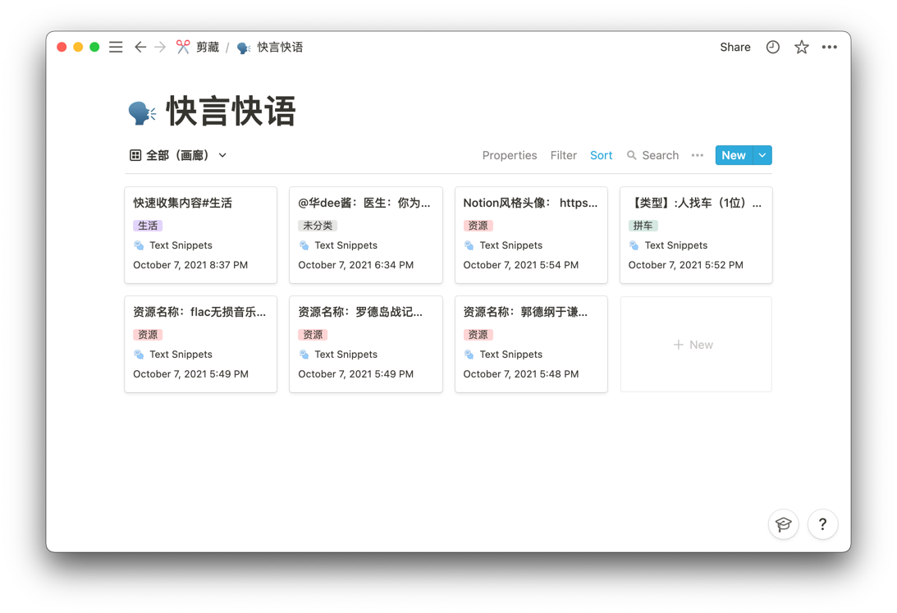
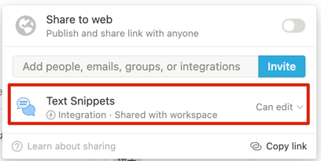
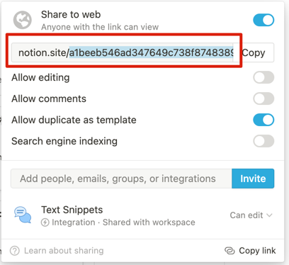
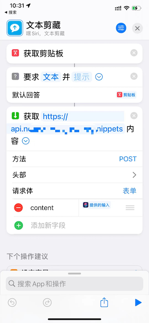

Notion Text Snippets
----
Notion + iOS快捷指令实现的随时随地文本收集功能

# Notion 配置

## 第一步：创建 integration

打开 [my integrations](https://www.notion.so/my-integrations) ,创建一个integration，并记录token。

## 第二步：创建 Database

打开 Notion，添加一个Database用来收集文本，并将前面创建的integration添加到share中。

## 第三步：获取 Database Id

点击Share to web，记录url后面的一串字符串，即：Database Id。

**记得再将Share的开关关闭！！！**

## 第四步：通过Api实现后面的内容

# 快捷指令配置

## 说明

URL设置为自己服务的地址