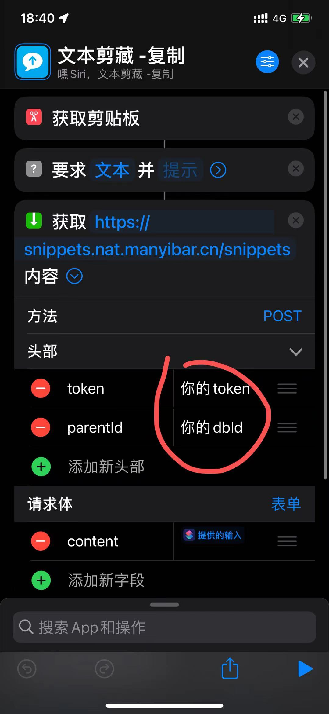

Notion Text Snippets
----
Notion + iOS快捷指令实现的随时随地文本收集功能

# 配置说明

1. 添加快捷指令：[快言快语快捷指令](https://www.icloud.com/shortcuts/ba3e60d821944bd49db16907e7577090)
2. 配置头部中的 `token` 和 `parentId`
    
    - token: 申请的 notion token
    - parentId: 创建的databaseId
# 使用说明

- [配合快捷指令实现文字快速收藏到notion（Save to Notion）](https://corebook.notion.site/notion-Save-to-Notion-f7e8fb296612427595f95f75ce9b62ad)